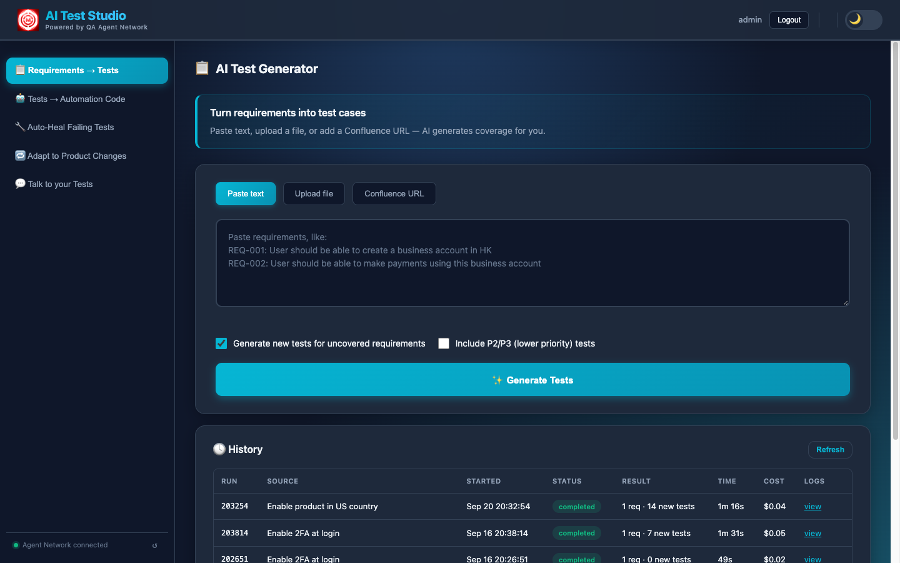
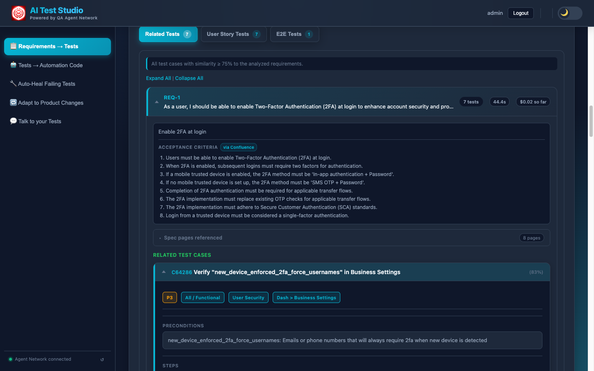
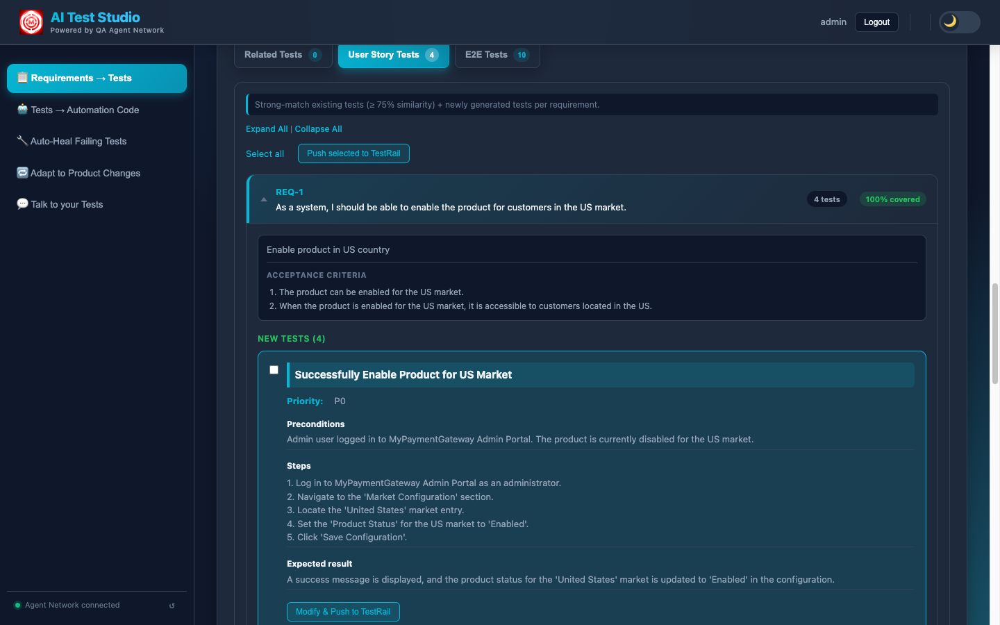
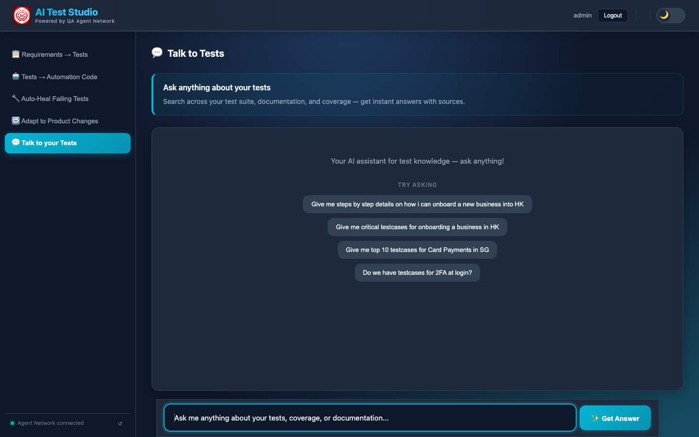
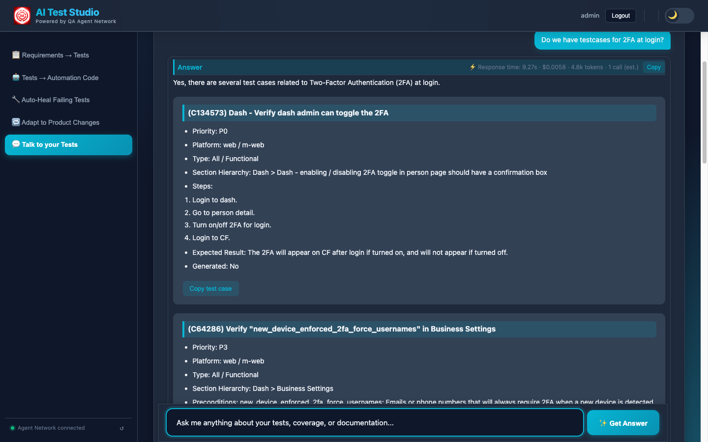
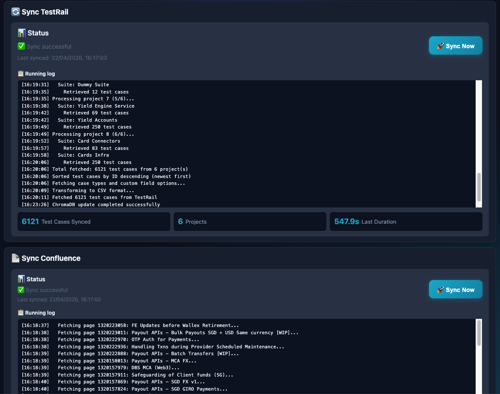

# AI Test Studio

**Powered by QA Agent Network**

**🌐 [msr5464.github.io/ai-agent-network](https://msr5464.github.io/ai-agent-network.html)**

[](https://www.python.org/)
[](LICENSE)

---

**📖 Detailed write-ups and feature deep-dives on the portfolio site:**

| Page | Link |
|------|------|
| Full system overview | [msr5464.github.io/ai-agent-network](https://msr5464.github.io/ai-agent-network.html) |
| 01 · Test Generation | [feature-test-generation](https://msr5464.github.io/feature-test-generation.html) |
| 02 · Test Authoring Agent | [feature-test-authoring](https://msr5464.github.io/feature-test-authoring.html) |
| 03 · Test Triaging Agent | [feature-test-triaging](https://msr5464.github.io/feature-test-triaging.html) |
| 04 · Test Healing Agent | [feature-test-healing](https://msr5464.github.io/feature-test-healing.html) |
| 05 · Talk to Tests | [feature-rag-chat](https://msr5464.github.io/feature-rag-chat.html) |

---

## Table of Contents

- [Overview](#overview)
- [What it does](#what-it-does)
- [Features](#features)
- [Screenshots](#screenshots)
- [Quick Start](#quick-start)
- [Configuration](#configuration)
- [Usage](#usage)
- [Project structure](#project-structure)
- [Documentation](#documentation)
- [Contributing](#contributing)
- [Troubleshooting](#troubleshooting)
- [License & contact](#license--contact)

---

## Overview

**AI Test Studio** is a web app that turns your requirements and test docs into an AI-powered QA workspace. It has three main workflows available to every customer:

1. **AI Test Generator** — Paste requirements, upload a file, or paste a Confluence URL. The app finds related existing tests, highlights tests that need updates, and generates new tests for gaps. Push generated tests to TestRail and use **Update with AI** on existing cases.
2. **Tests → Automation** — Turn plain-English test descriptions (or TestRail cases) into real, runnable Java automation code. The built-in **Test Authoring Agent** parses your description, validates DOM selectors via headless browser, writes framework-compliant Java files, runs Maven, iteratively fixes failures, and opens a GitHub PR — all streamed live in the browser.
3. **Talk to Tests** — Ask questions in plain language. Answers can come from your knowledge base (RAG over uploaded/synced docs) or from the LLM only.

Test and requirement data live in a **ChromaDB** vector store. Upload documents manually in the admin UI or sync from **TestRail** and **Confluence**; that data feeds both RAG chat and requirement analysis.

**Stack:** Flask (backend), static HTML/JS (customer and admin UIs), configurable **Ollama**, **OpenAI**, or **Google Gemini** for the LLM, and the embedded **QA Agent Network** for multi-agent automation pipelines.

---

## What it does

- **Requirement → test coverage** — Input: pasted text, PDF/DOCX/TXT file, or Confluence page URL. Output: extracted requirements, related existing tests (from ChromaDB), tests needing update (with AI-suggested changes), and generated tests for uncovered requirements. Push new tests to TestRail; update existing ones via **Update with AI**.
- **Automated test authoring** — Write test steps in plain English or fetch "Pending Automation" cases from TestRail. The Test Authoring Agent generates Java automation code targeting your framework, runs it, self-heals failures, and ships a GitHub PR with a full audit trail.
- **Improve for automation** — For TestRail cases with vague manual steps, the LLM rewrites them into deterministic, automation-ready step descriptions before queuing them for the authoring agent.
- **Chat over your docs** — Ask questions; get answers grounded in uploaded/synced documents (RAG) or from the LLM alone. Supports PDF, CSV, Excel, Word, PowerPoint, and text; TestRail and Confluence sync feed the same knowledge base.
- **Admin** — User management (create, delete, reset password; Admin/Customer roles), document upload, **TestRail sync** and **Confluence sync** (background), ChromaDB browse/reset, and basic stats.

---

## Features

### Customer portal

- **AI Test Generator** — Paste / upload (multiple files) / Confluence URL(s) → requirement extraction, related tests, tests needing update, generated tests (P0–P1 by default; optionally P2–P3), E2E workflow tests with regression impact analysis, push to TestRail, Update with AI for existing cases.
- **Tests → Automation** — Three modes:
  - **Write**: Plain-English description + module name + platform (Web / Mobile / API) → Test Authoring Agent → Java test code → Maven run → GitHub PR. Live streaming console with 5 progress steps.
  - **Saved Drafts**: Load previously saved module queue files.
  - **From TestRail**: Fetch cases with "Pending Automation" status, filter by project/suite/section/priority (P0–P3), click **Improve for Automation** to rewrite vague steps with the LLM, add to queue, and trigger the authoring agent.
- **Talk to Tests** — Natural-language Q&A; toggle **Internal docs** (RAG) or **Only LLM**.

### QA Agent Network (backend automation agents)

Three independent agents power the automation features:

| Agent | What it does |
|-------|-------------|
| **Test Authoring Agent** | Parses test description → validates real DOM selectors (headless Playwright) → writes Java Page Objects + Test classes → runs Maven → iteratively fixes failures → opens GitHub PR |
| **Test Triaging Agent** | Reads MySQL test results by build tag → Claude classifies each failure as `PRODUCT_BUG` or `AUTOMATION_ISSUE` → adversarial reviewer verifies → HTML report + Slack notification |
| **Test Healing Agent** | Picks queued broken-locator failures → Claude generates locator fixes → runs test to verify → git branch/commit/push → GitHub PR + Slack |

### Platform

- **Document ingestion** — Manual upload (PDF, CSV, Excel, Word, PowerPoint, text) plus TestRail and Confluence sync into one ChromaDB collection.
- **LLM & embeddings** — Ollama (local), OpenAI, or Gemini; configurable embeddings; optional query and embedding cache.
- **Auth** — Session-based login; Admin and Customer roles; default admin `admin` with a randomly generated password (shown once at first startup — save it!).
- **REST API** — Query, requirement analysis, upload, sync, auth, agents proxy; see [docs/API.md](docs/API.md).
- **Performance** — Parallel requirement processing, pre-warmed embedding caches, SSE streaming with per-requirement progress, thread-safe caching.
- **Security** — CORS origin restriction, login brute-force protection, security headers, path traversal protection.
- **Optional** — Hybrid search (BM25 + vector), reranking, query expansion; cost logging to `storage/operation_costs.jsonl`.

---

## Screenshots

### Customer portal — AI Test Generator

| Requirements → Tests tab |
|--------------------------|
|  |

Three input modes (paste text / upload file / Confluence URL), generates new tests only for uncovered requirements, pushes to TestRail.

| Analysis streaming — existing TestRail tests surfaced |
|-------------------------------------------------------|
|  |

| Newly generated tests for coverage gaps |
|-----------------------------------------|
|  |

---

### Customer portal — Tests → Automation

| Test Authoring Agent interface |
|-------------------------------|
|  |

Plain-English steps → Java code → Maven run → GitHub PR, streamed live.

| Live pipeline console and final PR output |
|-------------------------------------------|
|  |

---

### Customer portal — Talk to Tests

| Chat interface |
|----------------|
|  |

| Answer grounded in TestRail + Confluence knowledge base |
|---------------------------------------------------------|
|  |

---

### Admin portal

| Knowledge base stats (ChromaDB) |
|---------------------------------|
|  |

| TestRail sync streaming in real time |
|--------------------------------------|
|  |

User management, document upload, TestRail/Confluence sync, ChromaDB browse/reset, runtime LLM settings.

---

## Quick Start

### Prerequisites

- **Python 3.9+**
- **LLM**: Ollama (recommended for local), or OpenAI API key, or Google Gemini API key
- **LibreOffice** (optional): only for legacy `.doc` / `.ppt`; `.docx` / `.pptx` work without it
- **For Tests → Automation tab**: Node.js 18+, Java 11+, Maven 3.8+, and a Claude API key (Anthropic)

### Install

**macOS / Linux:**
```bash
chmod +x scripts/*.sh
bash scripts/install.sh
```

**Windows (PowerShell):**
```powershell
.\scripts\install.ps1
```

**Windows (Command Prompt):**
```cmd
scripts\install.bat
```

The install script creates a venv, installs dependencies, can install/start Ollama and pull a default model, creates `config/.env` from `config/env.example`, and initializes `storage/` directories.

### Run

**macOS / Linux:**
```bash
# Start the main app
bash scripts/run.sh

# (Optional) Start the QA Agent Network server — required for Tests → Automation tab
cd QA-Agent-Network
bash scripts/run-server.sh
```

**Windows:** `scripts\run.bat` or `.\scripts\run.ps1`.

### First-time setup

1. Set **`SECRET_KEY`** in `config/.env` (e.g. `python -c "import secrets; print(secrets.token_hex(32))"`).
2. Default admin: **username** `admin` — a random password is printed to the console on first startup. **Save it!** Change it via User Management in admin.
3. Set **`COMPANY_NAME`** in `config/.env` (or Admin → Settings → LLM) to your organization name — used in AI-generated test prompts.
4. For **AI Test Generator** and **TestRail/Confluence**: configure the relevant variables in `config/.env`; see [Configuration](#configuration) and [docs/DEPLOYMENT.md](docs/DEPLOYMENT.md#configuration).
5. For **Tests → Automation**: configure `QA-Agent-Network/config/.env` (copy from `.env.example`) with your Claude API key, GitHub token, Slack token, and MySQL credentials. Set `QA_AGENT_NETWORK_URL` in `config/.env` to point to the agent server (default `http://localhost:8765`).

### URLs (default port 5001)

- **Customer (AI Test Studio):** http://localhost:5001/
- **Admin:** http://localhost:5001/admin (login required)
- **API:** http://localhost:5001/api
- **QA Agent Network server (when running):** http://localhost:8765

---

## Usage

### Customer (http://localhost:5001/)

- **AI Test Generator** — Choose Paste text / Upload file / Confluence URL, enter input, click **Generate Tests**. View **Existing Tests**, **New Tests**, and **E2E Tests**; push selected tests to TestRail; use **Update with AI** on tests needing update.

- **Tests → Automation**
  - **Write** tab: Enter plain-English test steps, pick a module name and platform, click **Run Agent**. Watch the live streaming console as the agent parses, validates selectors, generates Java code, runs Maven, and ships a GitHub PR.
  - **Saved Drafts** tab: Load and re-run previously saved queue files.
  - **From TestRail** tab: Select project, suite, section, and priority filter. Cases with "Pending Automation" status are fetched from TestRail. Click **Improve for Automation** on individual cases to have the LLM rewrite vague manual steps into deterministic automation-ready steps. Add to queue, then click **Run Agent**.

- **Talk to Tests** — Type a question; choose **Internal docs** (RAG) or **Only LLM**; view answer and optional sources.

### Admin (http://localhost:5001/admin)

- **Login** with admin credentials.
- **User management** — Create/edit/delete users, reset passwords, Admin/Customer roles.
- **Document upload** — Upload files; they are chunked, embedded, and added to ChromaDB. List/delete shows only manually uploaded docs; TestRail/Confluence sync docs are internal.
- **TestRail sync** / **Confluence sync** — Trigger from the UI; runs in background. Status via sync status in the UI/API.
- **ChromaDB** — Browse collection and chunks; **Reset** clears the vector DB and sync metadata.
- **Stats** — Document and chunk counts.
- **Settings** — Change LLM provider, model, and API keys at runtime without restarting.

---

## Project structure

```
AI-Test-Studio/
├── backend/                        # Flask app and services
│   ├── app.py                     # Flask app, serves frontend and /api
│   ├── api/
│   │   ├── auth/                  # Login, logout, session, brute-force protection
│   │   ├── admin/                 # User mgmt, doc upload, sync, ChromaDB, settings
│   │   ├── customer/              # Requirement analysis, RAG query, TestRail push, automatable-case fetch
│   │   └── agents/proxy.py        # Thin proxy: /api/agents/* → QA Agent Network server
│   ├── services/                  # RAG, auth, sync, requirement analysis, Confluence sync, settings, scheduler
│   ├── rag/                       # RAG core: base_rag, multi_format_rag, settings, caching, chromadb_helper
│   ├── connectors/                # TestRail, Confluence
│   ├── extractors/                # Requirement extractor
│   └── models/                    # User model and storage
├── frontend/
│   ├── admin/                     # Admin UI (login, dashboard)
│   └── customer/                  # Customer UI (AI Test Studio — 3 tabs)
├── config/
│   ├── env.example                # Env template (all variables documented)
│   └── .env                       # Local config (create from env.example; do not commit)
├── QA-Agent-Network/              # Embedded multi-agent automation sub-repo
│   ├── agents/
│   │   ├── test-authoring-agent/  # Plain text → Java code → Maven → GitHub PR
│   │   ├── test-triaging-agent/   # MySQL test results → failure classification → Slack report
│   │   └── test-healing-agent/    # Broken locators → fix → verify → GitHub PR
│   ├── qa_agents_server/          # Flask+SSE HTTP server — wraps test-authoring-agent for the UI
│   ├── shared/                    # Shared utilities: Claude client, GitHub, Slack, git, logging
│   ├── config/                    # Agent .env, prompt templates, skill docs
│   ├── scripts/                   # run-server.sh, run-analyse.sh, run-autofix.sh, setup.sh
│   └── Makefile                   # Unified entry point for all agents
├── docs/                          # Documentation and screenshots
├── scripts/                       # install.*, run.*, init_storage.*
├── storage/                       # Runtime: documents, chroma_db, embedding_cache, users, sync metadata, operation_costs.jsonl
└── tests/                         # Pytest and evaluation
    └── evaluation/                # RAG evaluation scripts and test set
```

---

## Documentation

| Doc | Description |
|-----|-------------|
| [docs/ARCHITECTURE_GUIDE.md](docs/ARCHITECTURE_GUIDE.md) | How AI-Test-Studio, QA-Agent-Network, and Jarvis work together — full multi-repo architecture |
| [docs/DEPLOYMENT.md](docs/DEPLOYMENT.md) | Installation, configuration, production, scripts, troubleshooting |
| [docs/API.md](docs/API.md) | REST API: auth, admin, customer (query, requirement analysis, TestRail), agents proxy |
| [docs/HOW_IT_WORKS.md](docs/HOW_IT_WORKS.md) | Architecture, request flows, directory layout |
| [docs/AI_INSTRUCTIONS.md](docs/AI_INSTRUCTIONS.md) | Instructions for AI assistants (self-test before marking tasks complete) |
| [docs/CONTRIBUTING.md](docs/CONTRIBUTING.md) | Contribution guidelines |
| [docs/REQUIREMENT_SPEC_PLAN.md](docs/REQUIREMENT_SPEC_PLAN.md) | Requirement analysis spec, current state, roadmap |
| [docs/SELF_TESTING_REQUIREMENT_ANALYSIS.md](docs/SELF_TESTING_REQUIREMENT_ANALYSIS.md) | Config and checklist for testing requirement analysis |
| [QA-Agent-Network/README.md](QA-Agent-Network/README.md) | QA Agent Network: setup, agent details, Makefile commands |
| [SECURITY.md](SECURITY.md) | Security policy and vulnerability reporting |
| [CHANGELOG.md](CHANGELOG.md) | Version history and release notes |

---

## Contributing

1. Fork the repo, create a feature branch, make changes, open a Pull Request.
2. **Frontend:** HTML/CSS/JS in `frontend/`. **Backend:** Flask and services in `backend/`. **RAG core:** `backend/rag/`. **Agents:** `QA-Agent-Network/agents/`.
3. See [docs/CONTRIBUTING.md](docs/CONTRIBUTING.md) for full guidelines.

---

## Troubleshooting

| Issue | Suggestion |
|-------|------------|
| Python not found / wrong version | Install Python 3.9+; on Windows ensure "Add to PATH" is checked. |
| Scripts not executable | macOS/Linux: `chmod +x scripts/*.sh`. Windows PowerShell: `Set-ExecutionPolicy -ExecutionPolicy RemoteSigned -Scope CurrentUser`. |
| Port in use | Set `PORT` in `config/.env` (e.g. 5002). |
| Ollama not responding | Start Ollama (`ollama serve` or use install script); or set `LLM_PROVIDER=openai` (or `gemini`) and provide API keys. |
| No documents in RAG | Upload via admin or run TestRail/Confluence sync; ensure ChromaDB path and collection exist. |
| Requirement analysis / Generate Tests fails | Ensure LLM and ChromaDB are configured; see [docs/SELF_TESTING_REQUIREMENT_ANALYSIS.md](docs/SELF_TESTING_REQUIREMENT_ANALYSIS.md). |
| Tests → Automation tab shows connection error | Start the QA Agent Network server: `cd QA-Agent-Network && bash scripts/run-server.sh`. Ensure `QA_AGENT_NETWORK_URL` in `config/.env` points to it (default `http://localhost:8765`). |
| Test authoring agent fails / Maven errors | Ensure Java 11+, Maven 3.8+, and Node.js 18+ are installed. Check `QA-Agent-Network/config/.env` for a valid `ANTHROPIC_API_KEY` and GitHub credentials. |
| TestRail "From TestRail" tab shows no cases | Verify TestRail credentials in `config/.env` and that the selected suite has cases with your configured "Pending Automation" status field values. |

More: [docs/DEPLOYMENT.md](docs/DEPLOYMENT.md#troubleshooting).

---

## License & contact

- **License:** See [LICENSE](LICENSE).
- **Author:** Mukesh Rajput — [LinkedIn](https://www.linkedin.com/in/mukesh-rajput/)

---

## Acknowledgments

- [LangChain](https://www.langchain.com/) — RAG and LLM orchestration
- [ChromaDB](https://www.trychroma.com/) — Vector store
- [Ollama](https://ollama.ai/) — Local LLM
- [Anthropic Claude](https://www.anthropic.com/) — LLM powering the QA Agent Network
- [Playwright](https://playwright.dev/) — Headless browser for DOM selector validation in test authoring
- [Marked.js](https://marked.js.org/) — Markdown rendering in the frontend
