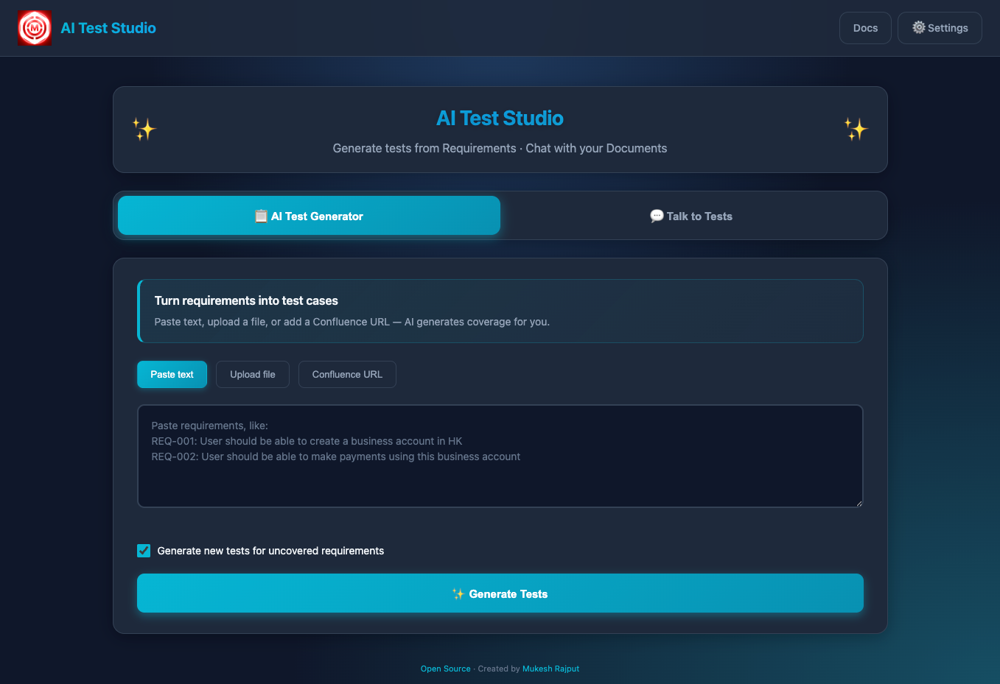
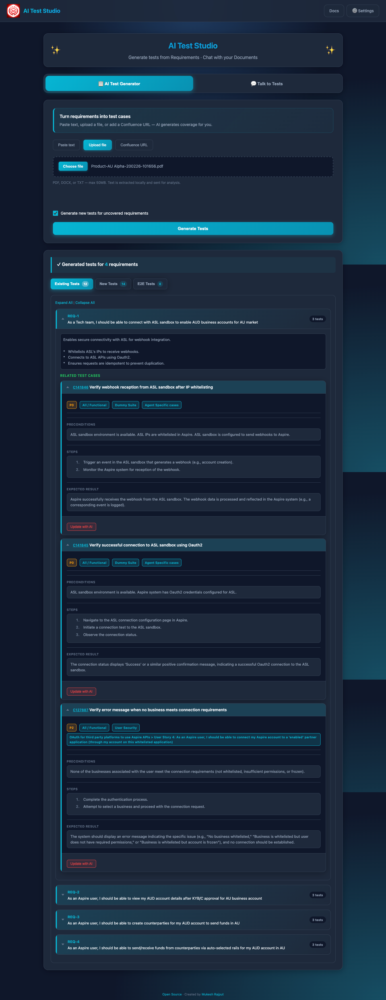
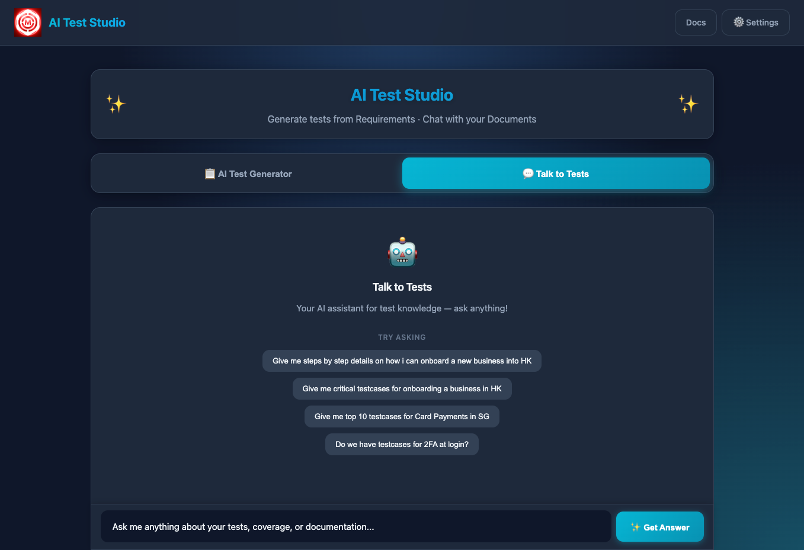
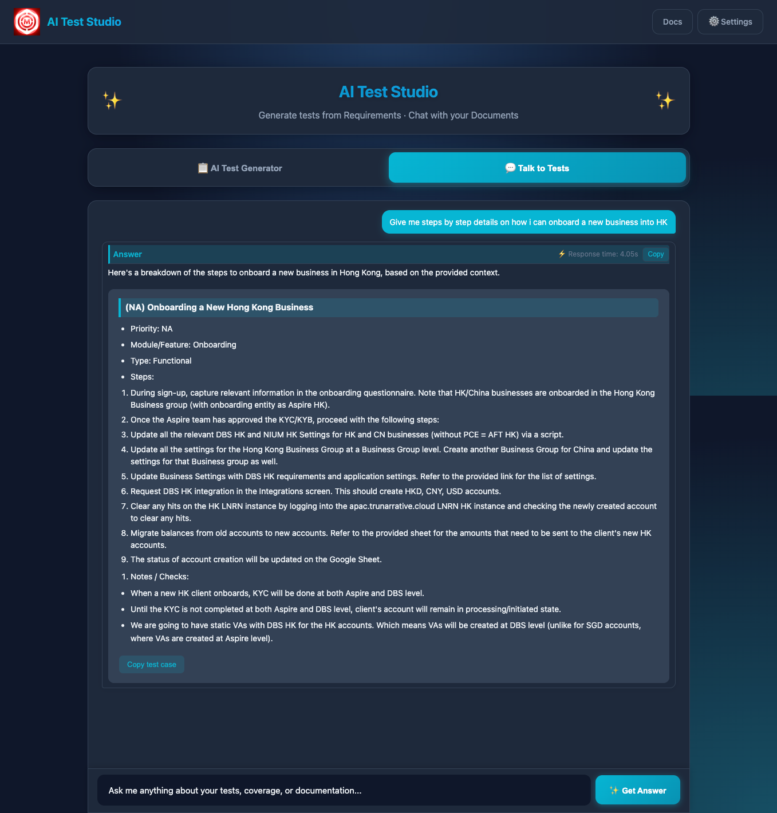
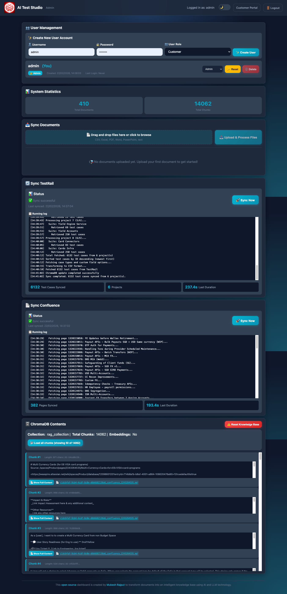

# AI Test Studio

**Generate tests from requirements · Chat with your documents.**

[](https://www.python.org/)
[](LICENSE)

---

## Table of Contents

- [Overview](#overview)
- [What it does](#what-it-does)
- [Features](#features)
- [Screenshots](#screenshots)
- [Quick Start](#quick-start)
- [Configuration](#configuration)
- [Usage](#usage)
- [Project structure](#project-structure)
- [Documentation](#documentation)
- [Contributing](#contributing)
- [Troubleshooting](#troubleshooting)
- [License & contact](#license--contact)

---

## Overview

**AI Test Studio** is a web app that turns your requirements and test docs into an AI-powered workspace. You get two main workflows:

1. **AI Test Generator** — Paste requirements, upload a file, or paste a Confluence URL. The app finds related existing tests, highlights tests that need updates, and generates new tests for gaps. You can push generated tests to TestRail and use **Update with AI** for existing cases.
2. **Talk to Tests** — Ask questions in plain language. Answers can come from your knowledge base (RAG over uploaded/synced docs) or from the LLM only.

Test and requirement data live in a **ChromaDB** vector store. You can upload documents manually in the admin UI or sync from **TestRail** and **Confluence**; that data is used for both RAG chat and requirement analysis. The stack is **Flask** (backend), static HTML/JS (customer and admin UIs), and configurable **Ollama**, **OpenAI**, or **Google Gemini** for the LLM.

---

## What it does

- **Requirement → test coverage** — Input: pasted text, PDF/DOCX/TXT file, or Confluence page URL. Output: extracted requirements, related existing tests (from ChromaDB), tests needing update (with AI-suggested changes), and generated tests for uncovered requirements. Push new tests to TestRail; update existing ones via **Update with AI**.
- **Chat over your docs** — Ask questions; get answers grounded in uploaded/synced documents (RAG) or from the LLM alone. Supports PDF, CSV, Excel, Word, PowerPoint, and text; TestRail and Confluence sync feed the same knowledge base.
- **Admin** — User management (create, delete, reset password; Admin/Customer roles), document upload, **TestRail sync** and **Confluence sync** (background), ChromaDB browse/reset, and basic stats.

---

## Features

- **AI Test Generator** — Paste / upload / Confluence URL → requirement extraction, related tests, tests needing update, generated tests (P0–P1 by default), push to TestRail, Update with AI for existing cases.
- **Talk to Tests** — Natural-language Q&A; toggle **Internal docs** (RAG) or **Only LLM**.
- **Document ingestion** — Manual upload (PDF, CSV, Excel, Word, PowerPoint, text) plus TestRail and Confluence sync into one ChromaDB collection.
- **LLM & embeddings** — Ollama (local), OpenAI, or Gemini; configurable embeddings; optional query and embedding cache.
- **Auth** — Session-based login; Admin and Customer roles; default admin `admin` / `admin123` (change after first login).
- **REST API** — Query, requirement analysis, upload, sync, auth; see [docs/API.md](docs/API.md).
- **Optional** — Hybrid search, reranking, query expansion; cost logging to `storage/operation_costs.jsonl`.

---

## Screenshots

Screenshots show the current customer and admin UIs.

### Customer portal

**AI Test Generator** — Input (paste / file / URL) and results (existing tests, new tests, E2E).

| Generate tests – input (paste / file / URL) |
|---------------------------------------------|
|  |

| Generate tests – results (existing tests, new tests, E2E) |
|-----------------------------------------------------------|
|  |

**Talk to Tests** — Ask a question and see the answer.

| Chat – ask a question |
|-----------------------|
|  |

| Chat – with answer |
|--------------------|
|  |

### Admin portal

| Dashboard |
|-----------|
|  |

Admin: user management, document upload, TestRail sync, Confluence sync, ChromaDB browse/reset, stats.

---

## Quick Start

### Prerequisites

- **Python 3.9+**
- **LLM**: Ollama (recommended for local), or OpenAI API key, or Google Gemini API key
- **LibreOffice** (optional): only for legacy `.doc` / `.ppt`; `.docx` / `.pptx` work without it

### Install

**macOS / Linux:**
```bash
chmod +x scripts/*.sh
bash scripts/install.sh
```

**Windows (PowerShell):**
```powershell
.\scripts\install.ps1
```

**Windows (Command Prompt):**
```cmd
scripts\install.bat
```

The install script creates a venv, installs dependencies, can install/start Ollama and pull a default model, creates `config/.env` from `config/env.example`, and initializes `storage/` directories.

### Run

**macOS / Linux:**
```bash
bash scripts/run.sh
```

**Windows:** `scripts\run.bat` or `.\scripts\run.ps1`.

### First-time setup

1. Set **`SECRET_KEY`** in `config/.env` (e.g. `python -c "import secrets; print(secrets.token_hex(32))"`).
2. Default admin: **username** `admin`, **password** `admin123` — change after first login (User Management in admin).
3. For **AI Test Generator** and **TestRail/Confluence**: configure the relevant variables in `config/.env`; see [Configuration](#configuration) and [docs/DEPLOYMENT.md](docs/DEPLOYMENT.md#configuration).

### URLs (default port 5001)

- **Customer (AI Test Studio):** http://localhost:5001/
- **Admin:** http://localhost:5001/admin (login required)
- **API:** http://localhost:5001/api

---

## Usage

### Customer (http://localhost:5001/)

- **AI Test Generator** — Choose Paste text / Upload file / Confluence URL, enter input, click **Generate Tests**. View **Existing Tests**, **New Tests**, and **E2E Tests**; push selected tests to TestRail; use **Update with AI** on tests needing update.
- **Talk to Tests** — Type a question; choose **Internal docs** (RAG) or **Only LLM**; view answer and optional sources.

### Admin (http://localhost:5001/admin)

- **Login** with admin credentials.
- **User management** — Create/edit/delete users, reset passwords, Admin/Customer roles.
- **Document upload** — Upload files; they are chunked, embedded, and added to ChromaDB. List/delete shows only manually uploaded docs; TestRail/Confluence sync docs are internal.
- **TestRail sync** / **Confluence sync** — Trigger from the UI; runs in background. Status via sync status in the UI/API.
- **ChromaDB** — Browse collection and chunks; **Reset** clears the vector DB and sync metadata.
- **Stats** — Document and chunk counts.

---

## Project structure

```
Knowledge-AI/
├── backend/                 # Flask app and services
│   ├── app.py              # Flask app, serves frontend and /api
│   ├── api/                # auth, admin, customer blueprints
│   ├── services/           # RAG, auth, sync, requirement analysis, Confluence sync
│   ├── rag/                 # RAG core: base_rag, multi_format_rag, settings, caching, chromadb_helper
│   ├── connectors/          # TestRail, Confluence
│   ├── extractors/         # Requirement extractor
│   └── models/             # User model and storage
├── frontend/
│   ├── admin/              # Admin UI (login, dashboard)
│   └── customer/           # Customer UI (AI Test Studio)
├── config/
│   ├── env.example         # Env template
│   └── .env                # Local config (create from env.example; do not commit)
├── docs/                    # Documentation and screenshots
├── scripts/                 # install.*, run.*, init_storage.*
├── storage/                # Runtime: documents, chroma_db, embedding_cache, users, sync metadata, operation_costs.jsonl
└── tests/                   # Pytest and evaluation
    └── evaluation/         # RAG evaluation scripts and test set
```

---

## Documentation

| Doc | Description |
|-----|-------------|
| [docs/DEPLOYMENT.md](docs/DEPLOYMENT.md) | Installation, configuration, production, scripts, troubleshooting |
| [docs/API.md](docs/API.md) | REST API: auth, admin, customer (query, requirement analysis, TestRail) |
| [docs/HOW_IT_WORKS.md](docs/HOW_IT_WORKS.md) | Architecture, request flows, directory layout |
| [docs/AI_INSTRUCTIONS.md](docs/AI_INSTRUCTIONS.md) | Instructions for AI assistants (self-test before marking tasks complete) |
| [docs/CONTRIBUTING.md](docs/CONTRIBUTING.md) | Contribution guidelines |
| [docs/REQUIREMENT_SPEC_PLAN.md](docs/REQUIREMENT_SPEC_PLAN.md) | Requirement analysis spec, current state, roadmap |
| [docs/SELF_TESTING_REQUIREMENT_ANALYSIS.md](docs/SELF_TESTING_REQUIREMENT_ANALYSIS.md) | Config and checklist for testing requirement analysis |

---

## Contributing

1. Fork the repo, create a feature branch, make changes, open a Pull Request.
2. **Frontend:** HTML/CSS/JS in `frontend/`. **Backend:** Flask and services in `backend/`. **RAG core:** `backend/rag/`.
3. See [docs/CONTRIBUTING.md](docs/CONTRIBUTING.md) for full guidelines.

---

## Troubleshooting

| Issue | Suggestion |
|-------|------------|
| Python not found / wrong version | Install Python 3.9+; on Windows ensure “Add to PATH” is checked. |
| Scripts not executable | macOS/Linux: `chmod +x scripts/*.sh`. Windows PowerShell: `Set-ExecutionPolicy -ExecutionPolicy RemoteSigned -Scope CurrentUser`. |
| Port in use | Set `PORT` in `config/.env` (e.g. 5002). |
| Ollama not responding | Start Ollama (`ollama serve` or use install script); or set `LLM_PROVIDER=openai` (or `gemini`) and provide API keys. |
| No documents in RAG | Upload via admin or run TestRail/Confluence sync; ensure ChromaDB path and collection exist. |
| Requirement analysis / Generate Tests fails | Ensure LLM and ChromaDB are configured; see [docs/SELF_TESTING_REQUIREMENT_ANALYSIS.md](docs/SELF_TESTING_REQUIREMENT_ANALYSIS.md). |

More: [docs/DEPLOYMENT.md](docs/DEPLOYMENT.md#troubleshooting).

---

## License & contact

- **License:** See [LICENSE](LICENSE).
- **Author:** Mukesh Rajput — [LinkedIn](https://www.linkedin.com/in/mukesh-rajput/)

---

## Acknowledgments

- [LangChain](https://www.langchain.com/) — RAG and LLM orchestration
- [ChromaDB](https://www.trychroma.com/) — Vector store
- [Ollama](https://ollama.ai/) — Local LLM
- [Marked.js](https://marked.js.org/) — Markdown rendering in the frontend
