# AI Test Studio

**Powered by QA Agent Network**

**🌐 [msr5464.github.io/ai-agent-network](https://msr5464.github.io/ai-agent-network.html)**

[](https://www.python.org/)
[](LICENSE)

---

**📖 Detailed write-ups on the portfolio site:**
[Full system overview](https://msr5464.github.io/ai-agent-network.html) ·
[Test Design Agent](https://msr5464.github.io/feature-test-design.html) ·
[Test Authoring Agent](https://msr5464.github.io/feature-test-authoring.html) ·
[Test Triaging Agent](https://msr5464.github.io/feature-test-triaging.html) ·
[Test Healing Agent](https://msr5464.github.io/feature-test-healing.html) ·
[Test Adaptation Agent](https://msr5464.github.io/feature-test-adaptation.html) ·
[Talk to Tests](https://msr5464.github.io/feature-rag-chat.html)

---

## Table of Contents

- [Overview](#overview)
- [Features](#features)
- [Screenshots](#screenshots)
- [Admin portal](#admin-portal)
- [Quick Start](#quick-start)
- [Configuration](#configuration)
- [Project structure](#project-structure)
- [Documentation](#documentation)
- [Troubleshooting](#troubleshooting)
- [License & contact](#license--contact)

---

## Overview

**AI Test Studio** is a web app that turns requirements and test docs into an
AI-powered QA workspace. Signed-in users get five pages:

| Page | URL | What it does |
|------|-----|--------------|
| 📋 **Requirements → Tests** | `/test-generator` | Paste requirements, upload files or give Confluence URLs. Finds related existing tests, flags tests needing an update, generates tests for the gaps, and pushes them to TestRail |
| 🤖 **Tests → Automation Code** | `/authoring-agent` | Plain-English steps (or TestRail cases) → the Test Authoring Agent writes Java automation, runs it, fixes it and opens a GitHub PR, streamed live |
| 🔧 **Auto-Heal Failing Tests** | `/healing-agent` | Pick a failing test (or a triaging handoff) → the Test Healing Agent repairs broken locators, verifies with the real test and opens a PR |
| 🔁 **Adapt to Product Changes** | `/adaptation-agent` | Describe how the product changed → the Test Adaptation Agent explores the live app and updates the affected tests (PR always needs review) |
| 💬 **Talk to your Tests** | `/talk-to-tests` | Ask questions answered from your knowledge base (RAG over synced TestRail cases and Confluence pages) |

Admins also get an **admin portal** (`/admin`) for users, connectors, the
knowledge base, analytics and settings.

**Stack:** Flask backend, static HTML/JS frontends, **ChromaDB** vector store,
a configurable LLM (**Ollama**, **OpenAI** or **Google Gemini**) for generation
and chat. The three agent pages are served by
[QA Agent Network](https://github.com/msr5464/QA-AI-Agent), a **separate repo**
that Studio reaches over HTTP; its agents use the Claude CLI.

---

## Features

### Requirements → Tests
- Input: pasted text, one or more `.txt` / `.pdf` / `.docx` / `.doc` files, or
  one or more Confluence page URLs (one input type per run).
- Output tabs: **Related Tests**, **User Story Tests** (new, P0–P1 by default,
  optionally P2–P3) and **E2E Tests** with regression impact.
- Runs in the background with a **Live Run** card (6 phases, cancellable) and a
  **History** you can replay; runs stop after 20 minutes.
- Push selected tests to TestRail; **Update with AI** rewrites existing cases.
  TestRail pushes require `TESTRAIL_PUSH_ENABLED=true` and are recorded on the run.

### Agent pages (Tests → Automation Code, Auto-Heal, Adapt)
- **Authoring** — *Write* plain-English steps (module + platform; Mobile is coming
  soon), load *Saved Drafts*, or pull *From TestRail* cases marked "Pending
  Automation" (with **Improve for Automation** to make vague steps deterministic).
- **Healing** — *Pick a Test* from the automation repo's catalogue (standalone
  reproduce-then-fix), or *From Triaging Agent* handoffs. Options: repair mode
  (park the failing browser) and force.
- **Adaptation** — *Write* a change note or load a *Saved Note*; pick the tests it
  affects (their intent contract is shown beside the note); explore-only and
  propose-only switches.
- On every agent page: a base-branch picker, live console with step progress,
  cancel, retry-from-step (authoring, adaptation), per-agent **History** with
  time and cost, a run queue when the agent server is busy, and an offline
  banner / sidebar health dot when it is unreachable.

The Test Triaging Agent is not in the Studio — it runs from the CLI or CI.

### Talk to your Tests
- Natural-language Q&A over the knowledge base, with sources and per-answer cost.

### Admin portal (`/admin`)
Users and sign-up approval, TestRail/Confluence connectors, the knowledge base,
**Analytics** (cost and time saved across the agents and the Studio), and the
settings of both the Studio and the agents — see [Admin portal](#admin-portal)
below for each section.

### Platform
- **Auth** — session login; every API except `/health`, login/sign-up and the
  public theme setting needs an approved account. Login and sign-up are rate-limited.
- **Security** — the app refuses to start with a placeholder `SECRET_KEY`;
  cookie hardening, CORS limited to your origins, security headers, and a shared
  secret with the agent server. See [SECURITY.md](SECURITY.md).
- **Cost tracking** — every LLM call is logged to `storage/operation_costs.jsonl`
  and feeds Analytics.
- **Retrieval** — hybrid search (BM25 + vector), reranking, query expansion,
  query and embedding caches.

---

## Screenshots

### Requirements → Tests

| Input and run history | Live run, replayable from History |
|-----------------------|-----------------------------------|
| 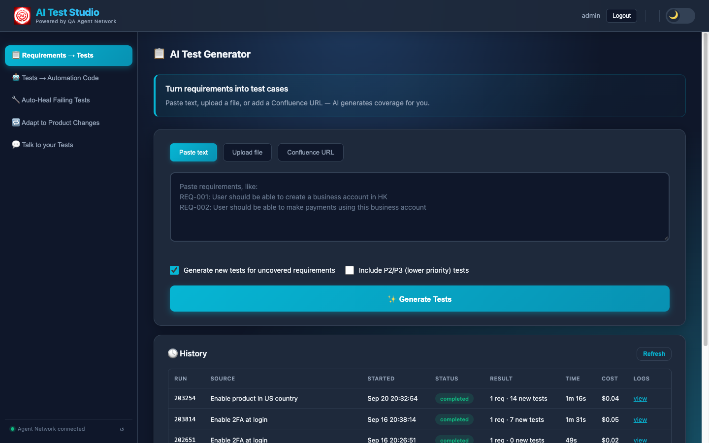 | 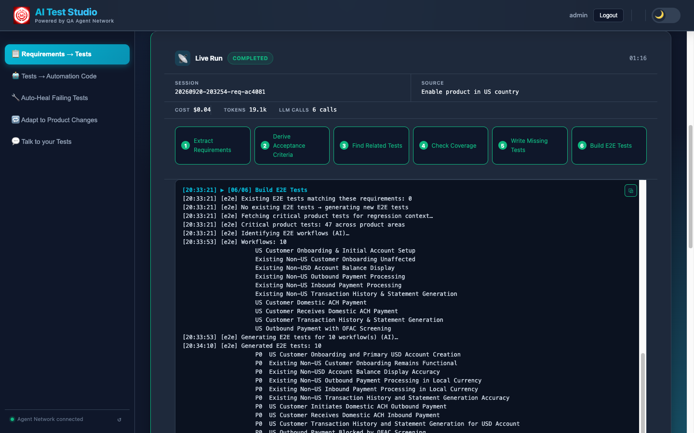 |

| Existing TestRail tests surfaced | Newly generated tests for coverage gaps |
|----------------------------------|-----------------------------------------|
|  |  |

### Tests → Automation Code

| Authoring agent | Live pipeline console and PR |
|-----------------|------------------------------|
| 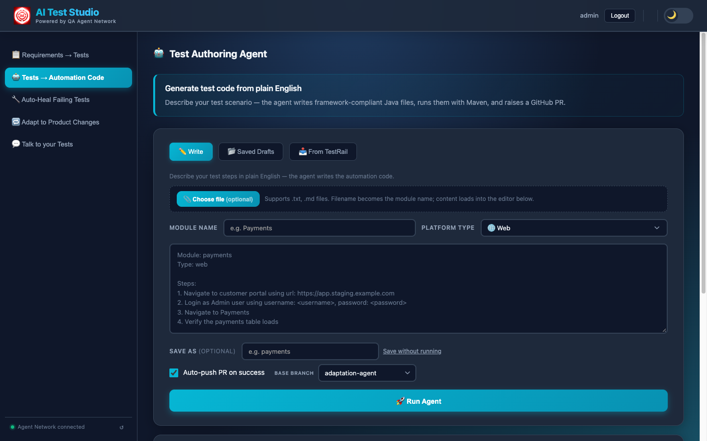 | 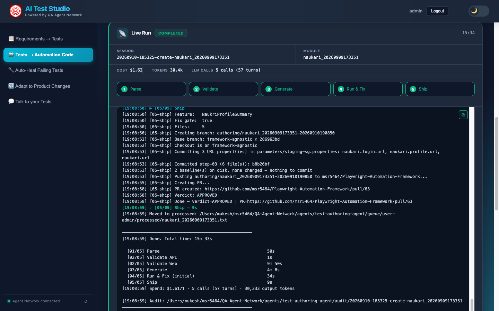 |

### Auto-Heal Failing Tests

| Pick a failing test | A run: Locate fixed both locators without a model call |
|---------------------|--------------------------------------------------------|
| 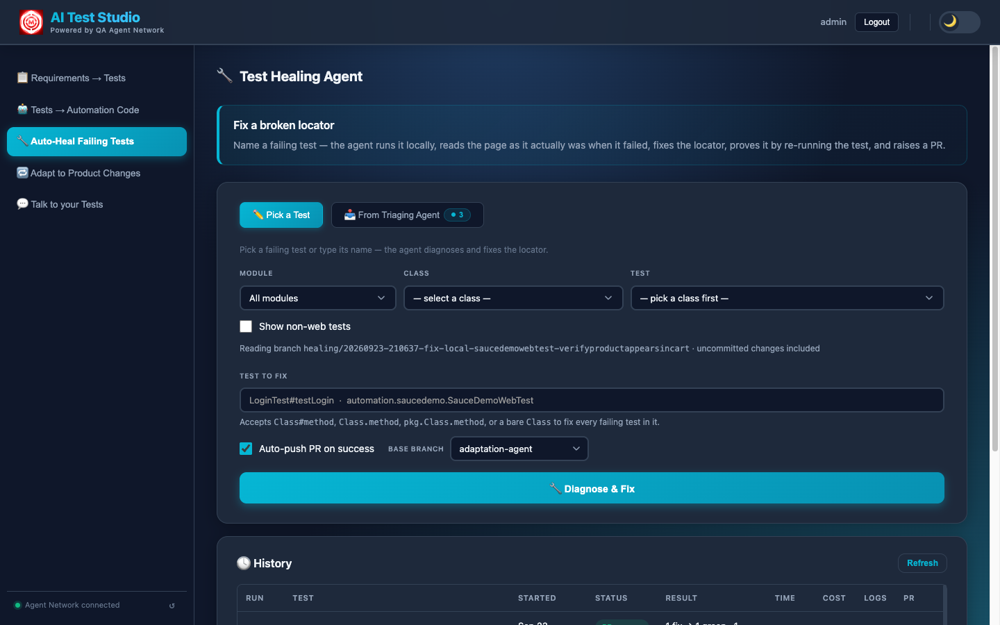 | 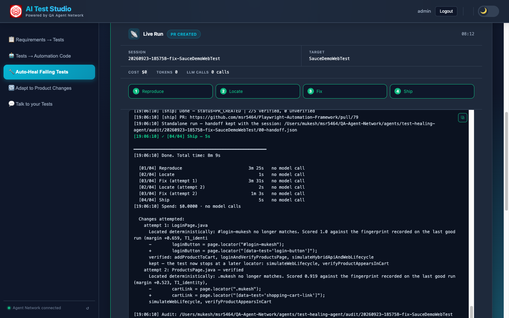 |

### Adapt to Product Changes

| Change note beside what the test proves today |
|-----------------------------------------------|
| 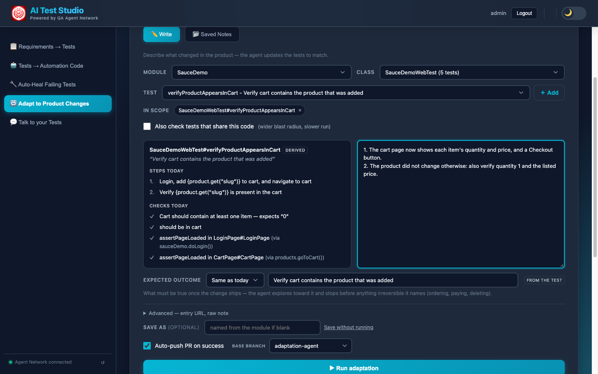 |

### Talk to your Tests

| Chat | Answer grounded in TestRail + Confluence |
|------|------------------------------------------|
|  |  |

---

## Admin portal

`/admin`, for users with the `admin` role. The left sidebar has six sections;
under them, live counts of documents, chunks and users.

### Users

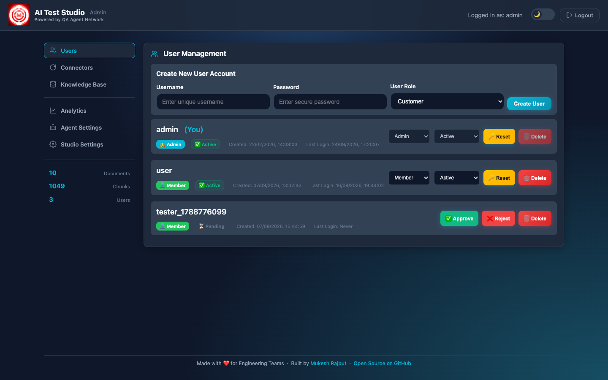

- Everyone who signs up lands here as **Pending** (role `member`) and cannot use
  the app until approved. **Approve**, **Reject** or later suspend them with the
  status selector.
- **Create User** makes an account directly (role `customer` or `admin`); it is
  active immediately — creating it is the approval.
- Change a role, **Reset** a password, or **Delete** a user. Demoting or
  deactivating the last active admin is refused.

### Connectors

TestRail and Confluence, side by side. **Sync Now** runs a background sync into
the knowledge base with a live step indicator (fetch → validate → update
knowledge base), a running log and totals (cases or pages synced, projects, last
duration). Failures show the connector's own error. Daily auto-sync and the
connection settings live in Studio Settings → TestRail / Confluence; schedule
times are UTC.


### Knowledge Base

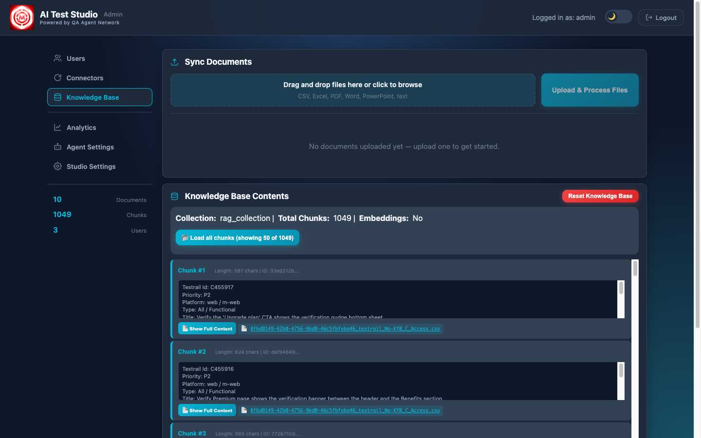

- **Upload & Process Files** adds test-case files to the knowledge base. The
  backend accepts **CSV/Excel test-case exports** only (at least 7 of the 10
  expected columns); a file that does not match is rejected with the reason.
- **Knowledge Base Contents** shows the collection, total chunks and each chunk
  with its source file (the first 50 load by default; **Load all chunks** fetches the rest).
- **Reset Knowledge Base** deletes every vector and both sync logs — re-sync
  afterwards. Needed after switching the embedding model (to or from OpenAI).

### Analytics

What the AI work cost and what it saved, for the agents and for the Studio's own
LLM features. Everything on the page follows the controls at the top:

- **Window** — 24 hours, 7 days, 30 days or all time (the default is set in
  Studio Settings → Analytics).
- **User** — all users, or one; members' runs are attributed to them.
- **QA Agents / AI Test Studio** — the two halves are shown separately and never
  added together: agent cost is **exact** (reported by the Claude CLI), Studio
  cost is **estimated** from a token rate card.

**QA Agents** — the authoring, healing and adaptation agents:

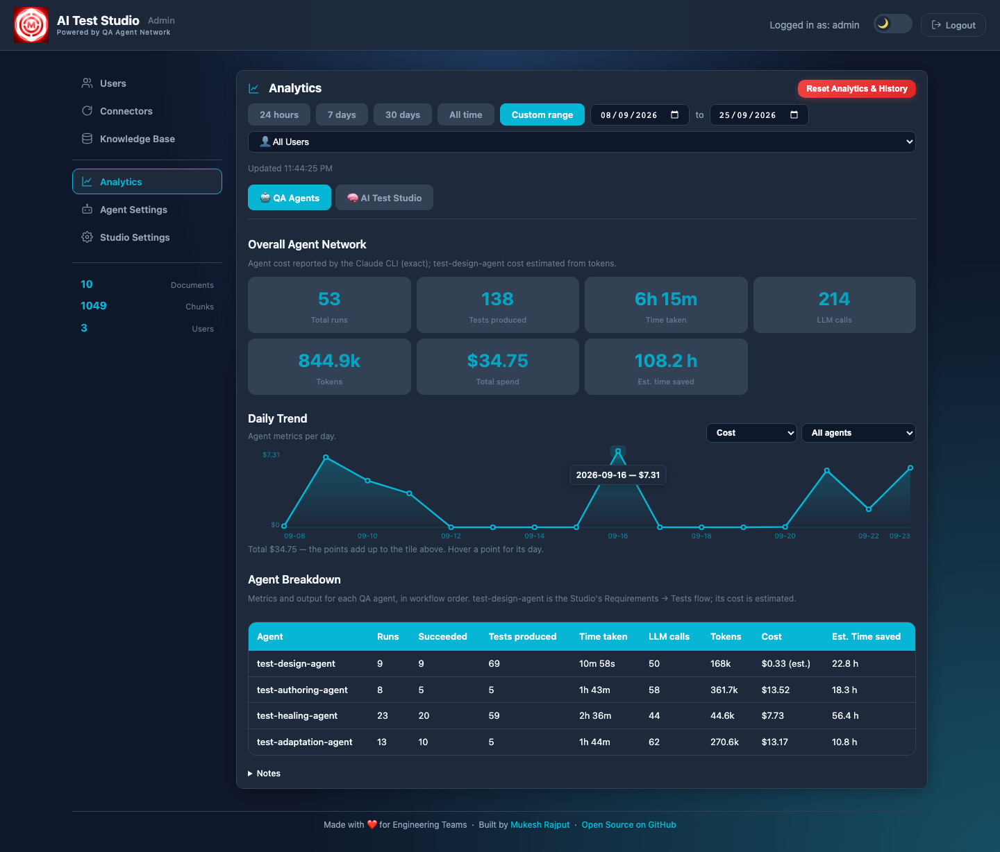

| Tile | Meaning |
|------|---------|
| Total runs | Runs in the window that reached a verdict (see *What counts as a run*); for `test-design-agent`, completed or failed Requirements → Tests runs |
| Tests produced | Test cases designed + tests authored (counted once they pass) + tests fixed + tests adapted |
| Time taken | Time the agents spent working; a resumed run's idle gap between attempts is not counted |
| LLM calls, Tokens, Total spend | From the Claude CLI's own usage report, except `test-design-agent`, whose cost is estimated from tokens |
| Est. time saved | Human time the outputs replace, minus the time the agents took (below) |

Each tile is the sum of the Agent Breakdown rows. Studio chat (Ask) and ingestion
are not included; they appear only on the AI Test Studio tab.

**Daily Trend** plots spend, LLM calls, tokens or time per day (toggle top-right;
hover a point for its value). **Agent Breakdown** gives the same numbers per agent,
with runs and how many succeeded. Its rows follow the testing workflow:
`test-design-agent` (the Studio's Requirements → Tests flow, estimated cost) →
`test-authoring-agent` → `test-triaging-agent` → `test-healing-agent` →
`test-adaptation-agent`. An agent with no activity in the window is left out.

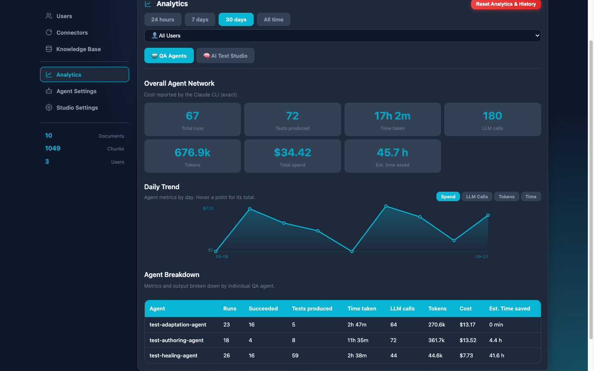

**What counts as a run.** Each run gets one outcome from its own audit files,
the same whether it was started here or from the command line. The collapsed
**Notes** section at the bottom of the page sums these up:

| Outcome | For example | In Runs / Succeeded | Spend and time |
|---|---|---|---|
| Completed | The agent's work passed: the test passes, or the fix is verified. Still completed if the push or PR then failed; that run's History says so, and the work is on a local branch or can be re-shipped | Run, succeeded | Counted |
| Diagnosed | The test already passes; the failure isn't a locator's; nothing to change; handed to a human by design; a test that reproduces a documented product defect | Run, succeeded | Counted |
| Failed | Tried and didn't get there | Run, not succeeded | Counted |
| Blocked | Missing credentials, the model call failed, the environment was unreachable, no test could run | Not counted | Counted |
| Cancelled, interrupted, explore-only | You cancelled it, the server restarted, or exploring was all it was asked to do | Not counted | Counted |
| Did nothing | No tokens, no spend and no output (the CLI returned nothing, or it stopped before its first step) | Not counted | Nothing to count |

**AI Test Studio** — Requirements → Tests, Talk to your Tests and knowledge
ingestion:

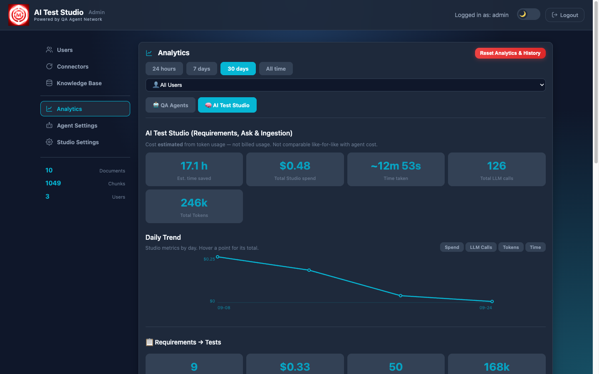

Headline tiles and a daily trend as above, then a card per flow:
**Requirements → Tests** (analysis runs, cost, calls, tokens, time, tests
generated, time saved, and spend by pipeline stage), **Talk to your Tests**
(questions asked, cost, average response time) and **Knowledge Ingestion**
(syncs, sync time, embedding cost), plus spend by area. When the selected window
starts before the first recorded data, **Notes** says when collection began.

**How time saved is estimated.** Each output is credited with a human-minutes
baseline — by default 240 min (4 h) per test authored, 60 per test fixed, 150
(2.5 h) per test adapted and 15 per test case written — and the machine's own run time is
subtracted; the result never goes below zero. Change the baselines in Studio
Settings → Analytics.

**Reset Analytics & History** deletes the selected window's analytics for the
selected user (or everyone) **and** the matching agent session history and audit
folders on the agent server. It cannot be undone.

Data comes from `storage/operation_costs.jsonl` and `storage/requirement_runs.jsonl`
(Studio) and the agent server's `/analytics/summary` (agents). If the agent server
is down, the QA Agents tab shows a warning, and its tiles cover `test-design-agent` only.

### Agent Settings

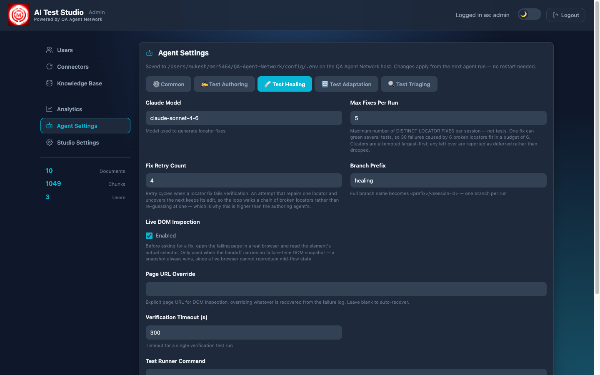

QA Agent Network's configuration without shell access, grouped as **Common**
(framework, workspace, automation repo, GitHub, Slack), **Test Authoring**,
**Test Healing**, **Test Adaptation** and **Test Triaging** (models, retry
budgets, branch prefixes, timeouts, the triaging database). Saving writes the
agent server's `config/.env` and applies from the next run — no restart. Secrets
are shown masked; leave a mask untouched to keep the stored value. A value also
set in an agent's own `.env` is flagged, because that file wins at run time.

### Studio Settings

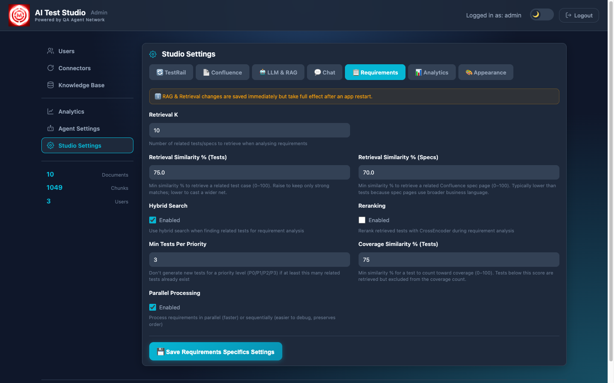

This app's own settings in seven tabs: **TestRail** and **Confluence**
(connection, delta sync, daily schedule), **LLM & RAG** (provider, model, keys),
**Chat** (Talk to your Tests retrieval), **Requirements** (retrieval thresholds,
hybrid search, reranking, coverage rules, parallelism), **Analytics** (time-saved
baselines, default window) and **Appearance** (default theme). Saving writes
`config/.env`. Changes to the LLM provider/model and to retrieval take full effect
after an app restart.

---

## Quick Start

### Prerequisites

- **Python 3.9+**
- **An LLM**: Ollama running locally (default), or an OpenAI or Google Gemini API key
- **Optional:** `antiword` for `.doc` requirement files (`install.sh` tries to install it); LibreOffice for legacy `.doc` / `.ppt` in the document loader
- **For the agent pages:** a running [QA Agent Network](https://github.com/msr5464/QA-AI-Agent)
  server and its prerequisites — the signed-in `claude` CLI, `gh`, Node.js 18+,
  JDK 21 and Maven — see its README

### 1. Install

```bash
bash scripts/install.sh          # macOS / Linux
.\scripts\install.ps1            # Windows PowerShell
scripts\install.bat              # Windows Command Prompt
```

Creates `venv/`, installs dependencies, creates `config/.env` from
`config/env.example` and initialises `storage/`. On macOS/Linux it installs
Ollama if missing; `install.bat` also starts it and pulls the default model.
Otherwise:

```bash
ollama serve & ollama pull llama3.2:3b
```

### 2. Set the secret key (required)

The app **refuses to start** with the placeholder `SECRET_KEY` in `config/.env`:

```bash
python3 -c "import secrets; print(secrets.token_urlsafe(48))"   # paste as SECRET_KEY=
```

(For a throwaway local run, `FLASK_DEBUG=true` allows the placeholder instead.)

### 3. Run

```bash
bash scripts/run.sh              # macOS / Linux  (scripts\run.bat or .\scripts\run.ps1 on Windows)
```

`run.sh` exits if `LLM_PROVIDER=ollama` and Ollama is not running.

Open http://localhost:5001. On first start the console prints a random password
for the **`admin`** user — it is shown once, so save it. Log in at
http://localhost:5001/admin, then create or approve other users.

### 4. Connect the agents (optional)

QA Agent Network lives in its own repo, next to this one:

```bash
cd ../QA-Agent-Network
bash scripts/run-server.sh       # http://127.0.0.1:6001
```

Studio finds it at `QA_AGENT_NETWORK_URL` (default `http://localhost:6001`). If you
set `QA_AGENT_PROXY_SECRET`, use the same value in both repos' `config/.env`.

### URLs

| | |
|---|---|
| Studio | http://localhost:5001/ (per-page URLs above) |
| Admin | http://localhost:5001/admin |
| API | http://localhost:5001/api — see [docs/API.md](docs/API.md) |
| Health (no auth) | http://localhost:5001/health |

---

## Configuration

[`config/env.example`](config/env.example) documents every setting. The ones
that matter first:

| Setting | Why |
|---------|-----|
| `SECRET_KEY` | Required; signs session cookies |
| `LLM_PROVIDER` + its keys (`OLLAMA_*`, `OPENAI_*`, `GOOGLE_API_KEY`) | The model for generation and chat |
| `COMPANY_NAME` | Used in generated-test prompts |
| `TESTRAIL_*`, `CONFLUENCE_*` | Sources for the knowledge base; `TESTRAIL_PUSH_ENABLED` for pushing tests |
| `QA_AGENT_NETWORK_URL`, `QA_AGENT_PROXY_SECRET` | Reaching the agent server |
| `CORS_ALLOWED_ORIGINS`, `SESSION_COOKIE_SECURE` | When serving beyond localhost / over HTTPS |

Most settings can also be changed in **Admin → Studio Settings**, which writes
them back into `config/.env`.
Production deployment: [docs/DEPLOYMENT.md](docs/DEPLOYMENT.md).

---

## Project structure

```
AI-Test-Studio/
├── backend/
│   ├── app.py            # Flask app: pages, blueprints, security settings
│   ├── api/              # auth/, admin/, customer/, agents/ (proxy to QA Agent Network)
│   ├── services/         # RAG, auth, sync, requirement analysis + runs, analytics, settings, scheduler
│   ├── rag/              # RAG engine, loaders, settings, caching
│   ├── connectors/       # TestRail, Confluence
│   ├── extractors/       # requirement extraction
│   ├── models/           # users
│   └── cost_tracker.py   # per-call LLM cost logging
├── frontend/             # customer/ (the five pages) and admin/ — static HTML/JS
├── config/env.example    # every setting; copy to config/.env
├── docs/                 # documentation + images/
├── scripts/              # install.*, run.*, run-production.sh, init_storage.*, run_eval.sh
├── storage/              # runtime data (git-ignored): chroma_db, documents, users, runs, costs
├── tests/                # pytest suite + evaluation/
└── gunicorn_config.py    # production server config
```

---

## Documentation

| Doc | Description |
|-----|-------------|
| [docs/ARCHITECTURE_GUIDE.md](docs/ARCHITECTURE_GUIDE.md) | How Studio works, request flows, and how it connects to QA Agent Network |
| [docs/DEPLOYMENT.md](docs/DEPLOYMENT.md) | Installation, configuration, production, troubleshooting |
| [docs/API.md](docs/API.md) | REST API: auth, admin, customer, agents proxy |
| [docs/CONTRIBUTING.md](docs/CONTRIBUTING.md) | Contribution guidelines |
| [tests/README.md](tests/README.md) | Running the tests; UI self-test checklist |
| [docs/AI_INSTRUCTIONS.md](docs/AI_INSTRUCTIONS.md) | Instructions for AI assistants working in this repo |
| [SECURITY.md](SECURITY.md) | Security policy and hardening checklist |
| [CHANGELOG.md](CHANGELOG.md) | Notable changes |
| [QA Agent Network](https://github.com/msr5464/QA-AI-Agent) | The agents: setup, architecture, server API |

---

## Troubleshooting

| Issue | Fix |
|-------|-----|
| `RuntimeError: SECRET_KEY is unset or set to a publicly known placeholder` | Set a real `SECRET_KEY` in `config/.env` (or `FLASK_DEBUG=true` locally) |
| Lost the admin password | It is printed once on first start. Reset it from another admin account, or see [DEPLOYMENT.md](docs/DEPLOYMENT.md#troubleshooting) |
| Agent pages say offline | Start QA Agent Network (`cd ../QA-Agent-Network && bash scripts/run-server.sh`); check `QA_AGENT_NETWORK_URL` and that `QA_AGENT_PROXY_SECRET` matches in both repos |
| Ollama not responding | `ollama serve`, or set `LLM_PROVIDER=openai` / `gemini` with an API key |
| Nothing found by Requirements → Tests or chat | The knowledge base is empty — run TestRail / Confluence sync in Admin → Connectors |

More: [docs/DEPLOYMENT.md](docs/DEPLOYMENT.md#troubleshooting).

---

## License & contact

- **License:** see [LICENSE](LICENSE).
- **Author:** Mukesh Rajput — [LinkedIn](https://www.linkedin.com/in/mukesh-rajput/)

## Acknowledgments

[LangChain](https://www.langchain.com/) · [ChromaDB](https://www.trychroma.com/) ·
[Ollama](https://ollama.ai/) · [Anthropic Claude](https://www.anthropic.com/) (QA Agent Network) ·
[Playwright](https://playwright.dev/) · [Marked.js](https://marked.js.org/)
